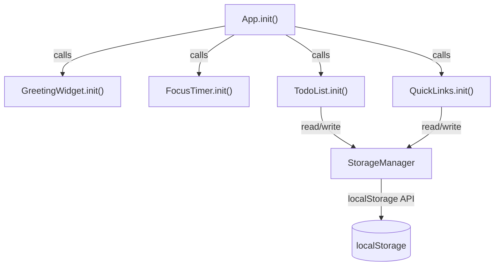
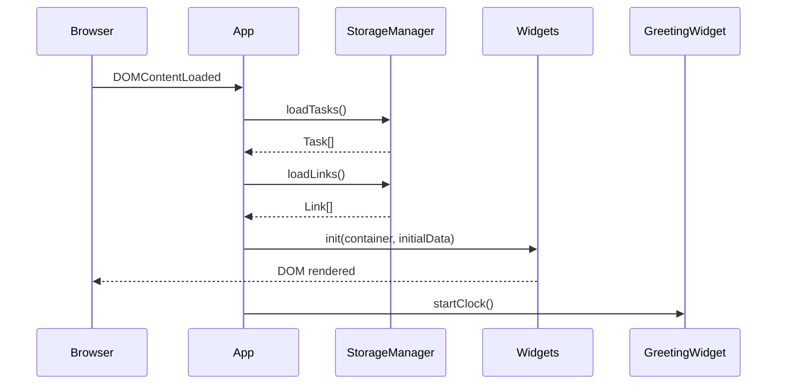

# Design Document: To-Do Life Dashboard

## Overview

The To-Do Life Dashboard is a zero-dependency, single-page web application delivered as three files: `index.html`, `css/style.css`, and `js/app.js`. There is no build step, no server, and no external requests — the page opens directly from disk via `file://` or any static host.

The application is organized as a collection of self-contained JavaScript modules inside `js/app.js`, each module owning one widget's state and DOM. A shared `StorageManager` module handles all reads and writes to `localStorage`. Modules communicate only through direct function calls; there is no event bus or shared mutable state between modules.

**Key design decisions:**

- **Module pattern via IIFEs / plain objects**: keeps the code readable without requiring ES modules or a bundler, and works over `file://` without CORS issues that `import` triggers in some browsers.
- **Single source of truth in memory**: each module keeps its data as a plain JS array/object and serializes to `localStorage` on every mutation. On page load the array is hydrated from storage.
- **No framework**: DOM manipulation is done with `document.createElement`, `innerHTML` (for static template strings), and `addEventListener`. This keeps the bundle size at zero and makes the page load near-instantaneous.

---

## Architecture

### File Layout

```
index.html          ← shell, widget markup containers, script/link tags
css/style.css       ← all visual styling
js/app.js           ← all application logic
```

### Module Structure inside `js/app.js`

```
js/app.js
├── StorageManager        — read/write localStorage, error handling
├── GreetingWidget        — clock tick, greeting text, date display
├── FocusTimer            — countdown state machine, audio/visual alert
├── TodoList              — task CRUD, inline edit, validation
├── QuickLinks            — link CRUD, URL normalization, validation
└── App.init()            — bootstraps all modules on DOMContentLoaded
```

Each module exposes an `init(containerElement)` function and manages its own internal state. No module reaches into another module's state.

### Module Interaction Diagram



### Initialization Sequence



---

## Components and Interfaces

### StorageManager

Responsible for all interaction with `localStorage`. All other modules call into this — they never call `localStorage` directly.

```js
StorageManager = {
  KEYS: {
    TASKS: 'tld_tasks',
    LINKS: 'tld_links',
  },

  // Returns Task[] — empty array on any error
  loadTasks()  → Task[],

  // Returns Link[] — empty array on any error
  loadLinks()  → Link[],

  // Serializes and writes; catches quota errors
  saveTasks(tasks: Task[])  → void,

  // Serializes and writes; catches quota errors
  saveLinks(links: Link[])  → void,

  // Internal — shows non-blocking toast on write failure
  _handleWriteError(err: Error)  → void,
}
```

**Error contract**: `loadTasks` and `loadLinks` never throw; they return `[]` on any parse or access failure. `saveTasks` and `saveLinks` catch `QuotaExceededError` and surface it as a UI toast, they do not throw to the caller.

---

### GreetingWidget

Owns the top-left greeting panel. Starts a `setInterval` that fires every 1 000 ms to update the display.

```js
GreetingWidget = {
  init(container: HTMLElement) → void,

  // Pure — maps hour (0-23) to greeting string
  getGreeting(hour: number) → string,

  // Pure — formats a Date to "Thursday, June 4, 2026"
  formatDate(date: Date) → string,

  // Pure — formats a Date to "HH:MM:SS"
  formatTime(date: Date) → string,

  _tick() → void,           // called by interval
  _intervalId: number|null,
}
```

---

### FocusTimer

Manages a countdown state machine with three states: `IDLE`, `RUNNING`, `PAUSED`.

```js
FocusTimer = {
  TOTAL_SECONDS: 1500,   // 25 × 60

  // States: 'IDLE' | 'RUNNING' | 'PAUSED'
  state: 'IDLE',
  remaining: 1500,

  init(container: HTMLElement) → void,
  start() → void,
  stop()  → void,
  reset() → void,

  _tick()          → void,  // called by interval each second
  _onComplete()    → void,  // fires at 00:00 — alert + disable buttons
  _render()        → void,  // syncs DOM to current state
  _formatTime(seconds: number) → string,  // "MM:SS"
  _intervalId: number|null,
}
```

**State machine transitions:**

```
IDLE  --[start]--> RUNNING
RUNNING --[stop]--> PAUSED
RUNNING --[tick→0]--> IDLE (completed)
PAUSED --[start]--> RUNNING
* --[reset]--> IDLE
```

---

### TodoList

Manages an in-memory `Task[]` array. Every mutation calls `StorageManager.saveTasks()` immediately.

```js
TodoList = {
  tasks: Task[],

  init(container: HTMLElement, initialTasks: Task[]) → void,
  addTask(text: string) → void,
  toggleComplete(id: string) → void,
  startEdit(id: string) → void,
  saveEdit(id: string, newText: string) → void,
  cancelEdit(id: string) → void,
  deleteTask(id: string) → void,

  _generateId() → string,   // crypto.randomUUID() or Date.now() fallback
  _validate(text: string) → { valid: boolean, error: string|null },
  _render() → void,
  _renderTask(task: Task) → HTMLElement,
}
```

---

### QuickLinks

Manages an in-memory `Link[]` array with a maximum of 50 entries. Every mutation calls `StorageManager.saveLinks()` immediately.

```js
QuickLinks = {
  links: Link[],
  MAX_LINKS: 50,

  init(container: HTMLElement, initialLinks: Link[]) → void,
  addLink(label: string, url: string) → void,
  deleteLink(id: string) → void,

  _normalizeUrl(url: string) → string,   // prepend https:// if no scheme
  _validateForm(label: string, url: string) → ValidationResult,
  _generateId() → string,
  _render() → void,
  _renderLink(link: Link) → HTMLElement,
}
```

---

### App (bootstrap)

```js
const App = {
  init() {
    const tasks = StorageManager.loadTasks();
    const links = StorageManager.loadLinks();
    GreetingWidget.init(document.getElementById('widget-greeting'));
    FocusTimer.init(document.getElementById('widget-timer'));
    TodoList.init(document.getElementById('widget-todo'), tasks);
    QuickLinks.init(document.getElementById('widget-links'), links);
  }
};

document.addEventListener('DOMContentLoaded', App.init);
```

---

## Data Models

### Task

```js
/**
 * @typedef {Object} Task
 * @property {string}  id        - Unique identifier (UUID or timestamp string)
 * @property {string}  text      - Task description, 1–500 characters
 * @property {boolean} completed - Completion status
 * @property {number}  createdAt - Unix timestamp (ms) of creation
 */
```

**localStorage key**: `tld_tasks`
**Storage format**: JSON array of Task objects

```json
[
  { "id": "abc123", "text": "Buy groceries", "completed": false, "createdAt": 1717459200000 },
  { "id": "def456", "text": "Read chapter 3", "completed": true,  "createdAt": 1717462800000 }
]
```

---

### Link

```js
/**
 * @typedef {Object} Link
 * @property {string} id        - Unique identifier
 * @property {string} label     - Display text, 1–50 characters
 * @property {string} url       - Full URL including scheme, 1–2048 characters
 * @property {number} createdAt - Unix timestamp (ms) of creation
 */
```

**localStorage key**: `tld_links`
**Storage format**: JSON array of Link objects

```json
[
  { "id": "g1h2", "label": "GitHub",  "url": "https://github.com",  "createdAt": 1717459200000 },
  { "id": "i3j4", "label": "YouTube", "url": "https://youtube.com", "createdAt": 1717462800000 }
]
```

---

### Storage Schema Summary

| Key         | Type          | Module        |
|-------------|---------------|---------------|
| `tld_tasks` | JSON (Task[]) | TodoList      |
| `tld_links` | JSON (Link[]) | QuickLinks    |

No other keys are written to `localStorage`. On a failed parse or missing key, the corresponding module receives an empty array and writes a fresh empty array on the next mutation.

---

### Key Algorithms

#### Greeting Logic

```
getGreeting(hour):
  if hour ∈ [5, 11]  → "Good Morning"
  if hour ∈ [12, 17] → "Good Afternoon"
  if hour ∈ [18, 20] → "Good Evening"
  if hour ∈ [21, 23] ∪ [0, 4] → "Good Night"
```

The `_tick()` function calls `new Date()` on every interval fire (every 1 000 ms), extracts `getHours()`, and re-evaluates the greeting so boundary transitions happen automatically.

#### Timer Countdown

```
start():
  if state == PAUSED or IDLE, set state = RUNNING
  _intervalId = setInterval(_tick, 1000)

_tick():
  remaining -= 1
  _render()
  if remaining == 0: _onComplete()

stop():
  clearInterval(_intervalId)
  state = PAUSED

reset():
  clearInterval(_intervalId)
  remaining = TOTAL_SECONDS
  state = IDLE
  _render()

_onComplete():
  clearInterval(_intervalId)
  state = IDLE   // completed variant — Start/Stop disabled until reset
  playAudioAlert()
  showVisualNotification()
```

The timer never accumulates drift in an observable way for a 25-minute session because each tick decrements by exactly 1 logical second; this is sufficient for a productivity timer (not a precision stopwatch).

#### Task ID Generation

```js
_generateId() {
  return (typeof crypto !== 'undefined' && crypto.randomUUID)
    ? crypto.randomUUID()
    : `task_${Date.now()}_${Math.random().toString(36).slice(2)}`;
}
```

`crypto.randomUUID()` is available in all target browsers over HTTPS and `file://` in modern versions. The fallback covers older Safari.

#### Storage Read/Write

```
loadTasks():
  raw = localStorage.getItem('tld_tasks')
  if raw == null: return []
  try:
    parsed = JSON.parse(raw)
    if not Array.isArray(parsed): return []
    return parsed
  catch:
    return []

saveTasks(tasks):
  try:
    localStorage.setItem('tld_tasks', JSON.stringify(tasks))
  catch (e):
    _handleWriteError(e)
```

Identical pattern for `loadLinks` / `saveLinks`.

---

## UI Layout and Widget Arrangement

### Grid Layout

The dashboard uses a CSS Grid two-column, two-row layout:

```
┌─────────────────────┬─────────────────────┐
│  Greeting Widget    │   Focus Timer        │
│  (top-left)         │   (top-right)        │
├─────────────────────┼─────────────────────┤
│  To-Do List         │   Quick Links        │
│  (bottom-left)      │   (bottom-right)     │
└─────────────────────┴─────────────────────┘
```

CSS Grid declaration (in `css/style.css`):

```css
.dashboard-grid {
  display: grid;
  grid-template-columns: 1fr 1fr;
  grid-template-rows: auto 1fr;
  gap: 16px;
  padding: 16px;
  min-height: 100vh;
  box-sizing: border-box;
}
```

The To-Do List column is scrollable (`overflow-y: auto`) so it accommodates up to 100+ tasks without disrupting the surrounding layout.

### HTML Skeleton

```html
<!DOCTYPE html>
<html lang="en">
<head>
  <meta charset="UTF-8" />
  <meta name="viewport" content="width=device-width, initial-scale=1.0" />
  <title>Life Dashboard</title>
  <link rel="stylesheet" href="css/style.css" />
</head>
<body>
  <main class="dashboard-grid">
    <section id="widget-greeting" class="widget"></section>
    <section id="widget-timer"    class="widget"></section>
    <section id="widget-todo"     class="widget widget--scrollable"></section>
    <section id="widget-links"    class="widget"></section>
  </main>
  <div id="toast" class="toast" aria-live="polite"></div>
  <script src="js/app.js"></script>
</body>
</html>
```

### Widget Internals (rendered by JS)

**Greeting Widget:**
```
┌────────────────────────────────┐
│  Good Morning                  │  ← h1, updates every tick
│  14:23:07                      │  ← .time, HH:MM:SS
│  Thursday, June 4, 2026        │  ← .date
└────────────────────────────────┘
```

**Focus Timer:**
```
┌────────────────────────────────┐
│  Focus Timer                   │
│        25:00                   │  ← .timer-display MM:SS
│  [Start]  [Stop]  [Reset]      │
└────────────────────────────────┘
```

**To-Do List:**
```
┌────────────────────────────────┐
│  To-Do List                    │
│  [_______________________] [+] │
│  ☐ Buy groceries  [✎] [🗑]    │
│  ☑ Read chapter 3 [✎] [🗑]   │ ← strikethrough text
│  ...                           │
└────────────────────────────────┘
```

**Quick Links:**
```
┌────────────────────────────────┐
│  Quick Links                   │
│  Label [________] URL [______] │
│  [Add Link]                    │
│  [GitHub ×]  [YouTube ×]       │
└────────────────────────────────┘
```

---

## Error Handling

| Scenario | Handling Strategy |
|---|---|
| `localStorage.getItem` returns `null` | Return `[]` (treated as fresh start) |
| `JSON.parse` throws on corrupted data | Catch, return `[]`, no error surfaced to user |
| `localStorage.setItem` throws `QuotaExceededError` | Catch in `StorageManager._handleWriteError`, show toast for ≥ 3 s |
| `localStorage` unavailable (private browsing in some browsers) | Same `saveTasks`/`saveLinks` catch handles it — toast shown |
| Add task with empty / whitespace-only text | Inline validation message below input; no task created |
| Add task with text > 500 characters | `_validate` rejects with inline message; input capped at `maxlength="500"` as UX guard |
| Edit task saved with empty / whitespace-only text | Inline validation message inside edit row; edit mode persists |
| Add link with empty label | Inline validation message next to label field; form values preserved |
| Add link with empty URL | Inline validation message next to URL field; form values preserved |
| Add link when 50 links already exist | Inline message: "Maximum of 50 links reached"; no link created |
| URL submitted without scheme | `_normalizeUrl` prepends `https://` before save |
| Timer Start clicked while running | Start button is disabled; no duplicate interval created |
| `crypto.randomUUID` unavailable | Falls back to `Date.now()` + `Math.random()` based ID |

Toast notifications are rendered into `#toast` (an `aria-live="polite"` region) and auto-dismiss after 3 seconds to remain non-blocking.

---

## Correctness Properties

*A property is a characteristic or behavior that should hold true across all valid executions of a system — essentially, a formal statement about what the system should do. Properties serve as the bridge between human-readable specifications and machine-verifiable correctness guarantees.*

The following properties are derived from the acceptance criteria. Requirements 1.3–1.6 were merged into one comprehensive greeting property because they all test the same pure function over the same domain. Requirements 3.4 and 3.5 were merged because together they express a toggle round-trip. Requirements 2.3 and 2.10 were merged because stop-preserving-state and resume-from-preserved-state are two halves of the same invariant.

---

### Property 1: Greeting covers all 24 hours

*For any* integer hour in the range [0, 23], `GreetingWidget.getGreeting(hour)` SHALL return exactly one of the four greeting strings and the result SHALL match the boundary rules:

| Hours | Expected greeting |
|---|---|
| 5 – 11 | "Good Morning" |
| 12 – 17 | "Good Afternoon" |
| 18 – 20 | "Good Evening" |
| 21 – 23 and 0 – 4 | "Good Night" |

No hour SHALL produce an empty string, `null`, or any other value.

**Validates: Requirements 1.3, 1.4, 1.5, 1.6**

---

### Property 2: Task serialization round-trip

*For any* non-empty array of Task objects (with arbitrary valid `id`, `text`, `completed`, and `createdAt` values), calling `StorageManager.saveTasks(tasks)` followed immediately by `StorageManager.loadTasks()` SHALL return an array that is deeply equal to the original array, preserving element order, text content, and `completed` status.

**Validates: Requirements 5.2, 5.4, 3.12**

---

### Property 3: Link serialization round-trip

*For any* non-empty array of Link objects (with arbitrary valid `id`, `label`, `url`, and `createdAt` values), calling `StorageManager.saveLinks(links)` followed immediately by `StorageManager.loadLinks()` SHALL return an array that is deeply equal to the original, preserving element order, labels, and URLs.

**Validates: Requirements 5.3, 5.4, 4.9**

---

### Property 4: Corrupted or missing storage returns empty array without throwing

*For any* value placed in `localStorage` under the tasks or links key that is (a) absent/`null`, (b) not valid JSON, or (c) valid JSON but not an array (e.g., a number, string, object, or `null`), calling `StorageManager.loadTasks()` or `StorageManager.loadLinks()` SHALL return `[]` and SHALL NOT throw an exception.

**Validates: Requirements 5.5, 5.6**

---

### Property 5: Invalid task input is rejected by validation

*For any* string that is composed entirely of whitespace characters (space, tab, newline, or any combination) OR whose trimmed length exceeds 500 characters, `TodoList._validate(text)` SHALL return `{ valid: false, error: <non-empty string> }` and calling `TodoList.addTask(text)` with such a string SHALL leave the task list length unchanged.

**Validates: Requirements 3.3, 3.15**

---

### Property 6: Valid task addition grows the list by exactly one

*For any* existing task list of length N and any string that passes validation (non-empty after trimming, length ≤ 500 characters), calling `TodoList.addTask(text)` SHALL produce a task list of exactly length N + 1. The newly added task SHALL be the last element, SHALL have a unique `id` not present in the previous list, and SHALL have `completed: false`.

**Validates: Requirements 3.2**

---

### Property 7: Task completion toggle is a round-trip

*For any* task with an arbitrary initial `completed` value, calling `TodoList.toggleComplete(id)` twice in succession SHALL leave the task's `completed` field equal to its original value, and the value after the first toggle SHALL be the logical negation of the original.

**Validates: Requirements 3.4, 3.5**

---

### Property 8: Edit cancel restores original text

*For any* task with text T, after calling `TodoList.startEdit(id)` and then `TodoList.cancelEdit(id)` (regardless of any intermediate typed value), the task's `text` field SHALL equal T, and the task list length SHALL be unchanged.

**Validates: Requirements 3.9**

---

### Property 9: Timer stop preserves remaining; resume continues from that value

*For any* remaining-seconds value R in [1, 1499], when `FocusTimer.remaining` is set to R and `FocusTimer.stop()` is called, the `remaining` field SHALL still equal R. When `FocusTimer.start()` is then called and one tick elapses, `remaining` SHALL equal R − 1 (not 1499).

**Validates: Requirements 2.3, 2.10**

---

### Property 10: Timer format always produces valid MM:SS

*For any* integer seconds value S in [0, 1500], `FocusTimer._formatTime(S)` SHALL return a string of the form `MM:SS` where:
- The string length is exactly 5 characters.
- MM is a zero-padded integer representing `Math.floor(S / 60)`, in range [00, 25].
- SS is a zero-padded integer representing `S % 60`, in range [00, 59].

**Validates: Requirements 2.6**

---

### Property 11: URL normalization always produces a scheme-prefixed URL

*For any* non-empty string that does NOT already begin with `http://` or `https://`, `QuickLinks._normalizeUrl(url)` SHALL return a string that begins with `https://` and whose suffix is exactly the original input.

*For any* string that already begins with `http://` or `https://`, `_normalizeUrl(url)` SHALL return the original string unchanged.

**Validates: Requirements 4.5**

---

### Property 12: Quick Links count never exceeds the maximum

*For any* links list whose length is exactly 50, calling `QuickLinks.addLink(label, url)` with any valid label and URL SHALL leave the list length at 50 (no new entry added). The list contents SHALL be identical to the pre-call list.

**Validates: Requirements 4.11**

---

